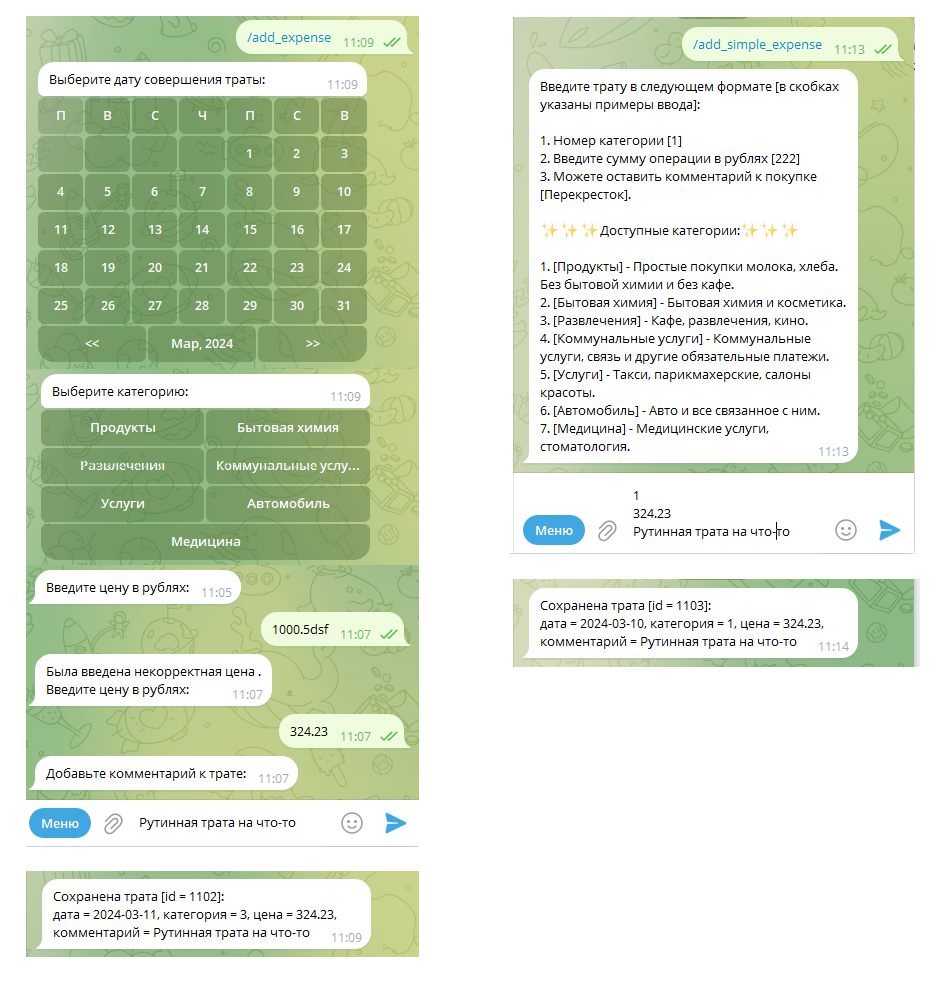
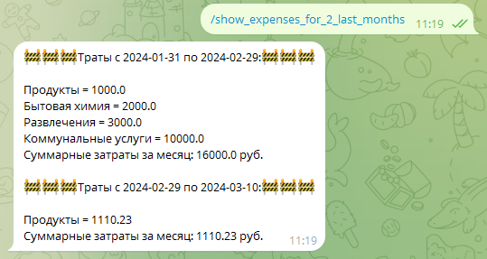

# RichManBot

Телеграмм бот учета и статистики повседневных трат

## Используемые инструменты и технологии

Java 17

Spring

Spring Data JPA

PostgreSQL

Telegram Bot API

Настройки приложения указаны в файле "application.properties". 
Для запуска приложения требуется указать bot.name, bot.token, а также настройки подключения к базе данных.

## Назначение и цели создания бота

У каждого человека есть какие-то отношения с деньгами. И, как и другие отношения, они могут быть здоровыми или не очень.
Регулярное отслеживание расходов позволяет увидеть, как меняется наше покупательское поведение, 
а также отследить некоторые привычки по тратам. 

Отслеживание в конечном итоге помогает в управлении личными финансами, позволяет строить бюджет, 
планировать траты и достигать своих финансовых целей.
Для лучшего анализа расходов, траты нужно делить на категории (например, обязательные траты или развлечения).

## Функционал бота (команда "/help")

Этот бот сохраняет записи о расходах и анализирует их по доступным категориям.

Вы можете выбрать команды из главного меню или ввести их вручную:

Введи /start для отражения приветственного сообщения;

Введи /show_categories для отображения всех доступных категорий трат;

Введи /add_expense для сохранения записи о расходах;

Введи /add_simple_expense для сохранения записи о расходах в текстовой форме;

Введи /delete_expense_by_id для возможного удаления 10 последних расходов;

Введи /show_expenses_for_2_last_months для получения статистики по категориям расходов за 2 последних месяца.

Ниже будут рассмотрены функции программы подробнее

### Сохранение траты

В боте есть две возможности внесения траты: 

1. Подробный (с выбором даты, категории, суммы, комментария покупки). 
Доступен через команду "/add_expense".
Ввод расхода в этом случае состоит из последовательных ответов на вопросы от бота.

2. Сокращенный, в текстовом формате (категория, сумма, комментарий покупки).
Доступен через команду "/add_simple_expense". 
Формат для сохранения трат будет отправлен в сообщении после выбора команды (можно посмотреть на картинках ниже).

После ввода необходимой информации по тратам, промежуточные сообщения будут удалены (сделано для прозрачной хронологии трат).

### Получение статистики по категориям

После ввода пункта меню "/show_expenses_for_2_last_months" будет отправлено сообщение 
с тратами по категориям за 2 последних месяца. Формат указан на фото ниже.

### Удаление траты по id

После ввода пункта меню "/delete_expense_by_id" будет предоставлен выбор из 9 последних трат для выбора удаляемого.
После выбора id указанная трата будет удалена. 

